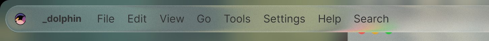

# liquid glassy (linux, interface-upgrade)

## dynamic "liquid glassy" ui-effect ('better-blur' plasma-extension)

(req.: linux, kde-plasma: 6.3.6+, qt: 6.8.2+)
*precompiled* for easy installation

source: https://github.com/iGerman00/kwin-effects-forceblur

# install (debian)
> wget https://github.com/slynobody/liquid-plasma_better_blur/releases/download/1.6/int_better_blur_liquid_1-6_amd64.deb
> 
> sudo apt install ./int_better_blur_liquid_1-6_amd64.deb
> 
> wget https://raw.githubusercontent.com/slynobody/liquid-plasma_better_blur/refs/heads/main/defaults
>
> cp ~/.config/kwinrc ~/.config/kwinrc_bu
> 
> cat ./defaults > ~/.config/kwinrc
> 
> kcmshell6 kcm_kwin_effects

to use: simply 
1. disable old 'blur effect' (settings-window)
2. enable 'better blur' (settings-window)
3. use a theme that supports translucency, like [this](https://github.com/vinceliuice/MacTahoe-kde)
   
# install (arch)
soon to come

# Disclaimer
1. Use at your own risk!
2. This is for educational and research purposes only!
3. No responsibility taken for any local customizations of the git!

